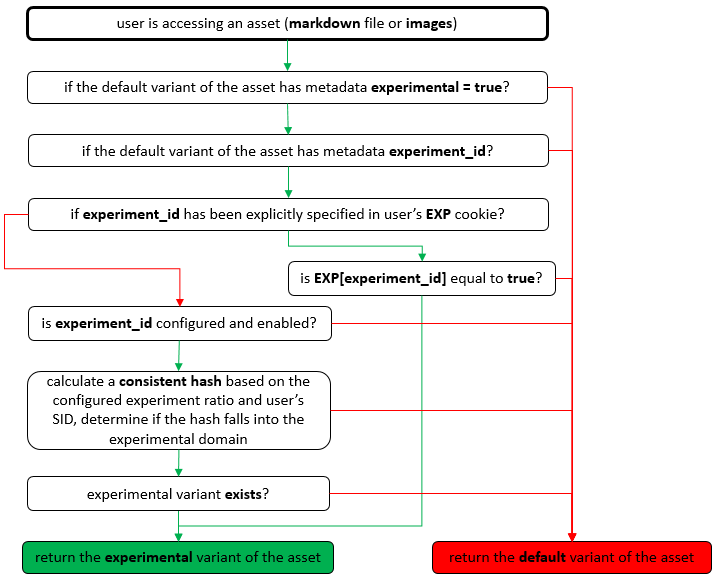

# A/B Testing

**Content Level A/B Testing:** A/B testing on specific documents or resources.

**Global A/B Testing:** A/B testing on a wide scope, for example theme and page layout which applies to all articles in a given site (or specific locale).

   

## Content Level A/B Testing
*Content Level A/B Testing* allows **content owners** to self-service, having variants of contents delivered from the same URL, specifying the split ratio and getting the BI statistics.

For example, writers can have **hello.md** and **hello.experimental.md**, and specify that only 10% of the end users would see the experimental version of the document.

### Design Principles:

1. Keep things **simpler** if possible, avoid over design - especially piling up features that are not actually used.
2. All **types of contents** should be able to run A/B testing, including markdown files, plain HTML files, images and audio/video files.
2. The A/B testing **granularity** should be flexible, either covering a single document, or a large group of assets (e.g. images).
3. Users should be **affinitized**, which means once a user was routed to version A, he/she should always see version A document unless the browser session info has been explicitly wiped out.
4. Should be **fast**, creating a new test, turning on/off an A/B testing, or updating the split ratio should take effect in **less than 30 seconds**.
5. **Corner cases should be covered properly**, A/B testing should work smoothly in a **CDN environment**. Also, special logic should be in place to make sure only the default variant *"the A version"* is retrieved by **search crawlers** like Google and Bing.
6. Naturally **integrated** into BI and Insights.

### Internal Flow Diagram:

   

## Global Level A/B Testing

*Global Level A/B Testing* enables two major scenarios:

- It allows certain feature hypothesis to be practically verified or proved, typically via a collaboration of **the feature stakeholder, feature PM and developers**.
- It allows **engineering team** to roll out a feature smoothly.

### Sample Code (ECMAScript)

    var experiment_id = 'global-testing-demo';
    Experiment.IsEnabledAsync(experiment_id).done(function(fEnabled){
        if (fEnabled) {
            // do something, in case the experiment is ON for this specific session
        } else {
            // do something else, in case the experiment is OFF for this specific session
        }
    });
