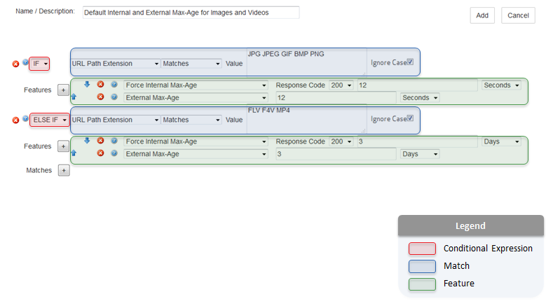

# Azure Content Delivery Network Rules Engine
This topic lists detailed descriptions of the available match conditions and features for Azure Content Delivery Network (CDN) [Rules Engine](cdn-rules-engine.md).

The HTTP Rules Engine is designed to be the final authority on how specific types of requests are processed by the CDN.

**Common uses**:

- Override or define a custom cache policy.
- Secure or deny requests for sensitive content.
- Redirect requests.
- Store custom log data.

## Terminology
A rule is defined through the use of [**conditional expressions**](cdn-rules-engine-reference-conditional-expressions.md), [**matches**](cdn-rules-engine-reference-match-conditions.md), and [**features**](cdn-rules-engine-reference-features.md). These elements are highlighted in the following illustration.

 

## Syntax

The manner in which special characters will be treated varies according to how a match condition or feature handles text values. A match condition or feature may interpret text in one of the following ways:

1. [**Literal Values**](#literal-values) 
2. [**Wildcard Values**](#wildcard-values)
3. [**Regular Expressions**](#regular-expressions)

### Literal Values
Text that is interpreted as a literal value will treat all special characters, with the exception of the % symbol, as a part of the value that must be matched. In other words, a literal match condition set to `\'*'\` will only be satisfied when that exact value (i.e., `\'*'\`) is found.
 
A percentage symbol is used to indicate URL encoding (e.g., `%20`).

### Wildcard Values
Text that is interpreted as a wildcard value will assign additional meaning to special characters. The following table describes how the following set of characters will be interpreted.

### Regular Expressions

Regular expressions define a pattern that will be searched for within a text value. Regular expression notation defines specific meanings to a variety of symbols. The following table indicates how special characters are treated by match conditions and features that support regular expressions.

## Next steps
* [Rules Engine Match Conditions](cdn-rules-engine-reference-match-conditions.md)
* [Rules Engine Conditional Expressions](cdn-rules-engine-reference-conditional-expressions.md)
* [Rules Engine Features](cdn-rules-engine-reference-features.md)
* [Overriding default HTTP behavior using the rules engine](cdn-rules-engine.md)
* [Azure CDN Overview](cdn-overview.md)
